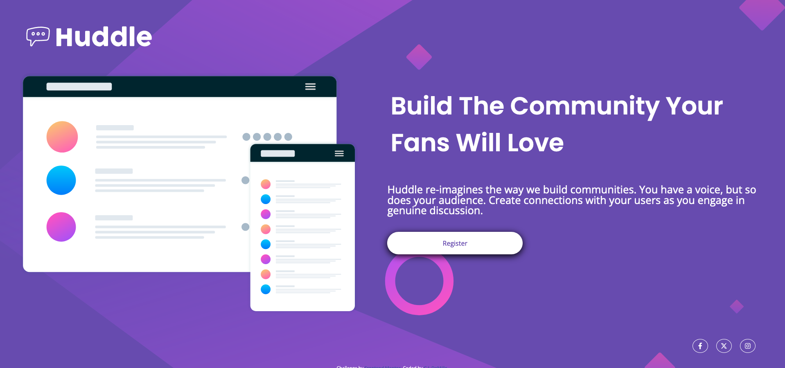

# Frontend Mentor - Huddle landing page with single introductory section solution

This is a solution to the [Huddle landing page with single introductory section challenge on Frontend Mentor](https://www.frontendmentor.io/challenges/huddle-landing-page-with-a-single-introductory-section-B_2Wvxgi0). Frontend Mentor challenges help you improve your coding skills by building realistic projects. 

## Table of contents

- [Overview](#overview)
  - [The challenge](#the-challenge)
  - [Screenshot](#screenshot)
  - [Links](#links)
- [My process](#my-process)
  - [Built with](#built-with)
  - [What I learned](#what-i-learned)
  - [Continued development](#continued-development)
  - [Useful resources](#useful-resources)
- [Author](#author)
- [Acknowledgments](#acknowledgments)

**Note: Delete this note and update the table of contents based on what sections you keep.**

## Overview

### The challenge

Users should be able to:

- View the optimal layout for the page depending on their device's screen size
- See hover states for all interactive elements on the page

### Screenshot

### Links

- Solution URL: [Add solution URL here](https://github.com/cjdemille/huddle-landing-page.git)
- Live Site URL: [Add live site URL here](https://cjdemille.github.io/huddle-landing-page/)

## My process

### Built with

- Semantic HTML5 markup
- CSS custom properties
- Flexbox
- Mobile-first workflow

### What I learned

This project gave me the opportunity to work with sizing background graphics to blend in with the rest of the site.  I took a mobile first approach to design the web page and decided that vanilla CSS and flexbox.

### Continued development

I think I can play around with the "register" button on the desktop design. I'm not 100% happy with it. I also think this site desperately needs another breakpoint. 

## Author

- Website - [C.J. DeMille](https://www.cdemille.com)
- Frontend Mentor - [@cjdemille](https://www.frontendmentor.io/profile/cjdemille)
